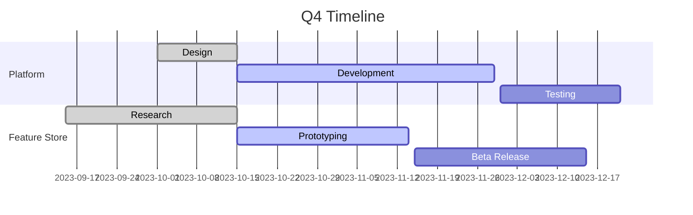

# Quarterly Planning Session - Q4 2023

## Strategic Priorities
- Complete [[ML platform]] v2.0 release
- Onboard 3 new team members
- Improve model inference speed by 40%
- Launch [[feature store]] for cross-team usage

> We need to focus on scalability challenges as our user base grows beyond 100k monthly active users

### Resource Allocation
| Project | Engineering Hours | Budget | Priority |
|---------|------------------|--------|----------|
| ML Platform | 1200 | $85K | High |
| Feature Store | 800 | $60K | Medium |
| DevOps Automation | 400 | $30K | Low |

## Challenges Identified
- [[Data quality]] issues affecting model performance
- [[Technical debt]] in prediction service
- Cross-team dependencies causing bottlenecks

This connects to discussions in [[note_05.md|ML Engineering Team Meeting]] and resource planning from [[note_19.md|Annual Budget Review]].

#planning #management #strategy #projects